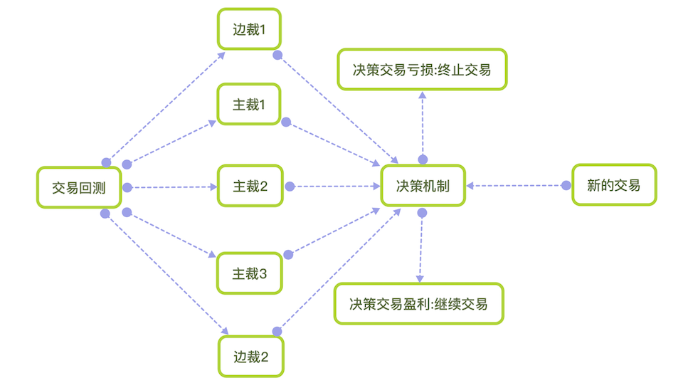

<center>
        <font size="6" color="black"><b>abu: Redefine Quantitative Trading System </b></font>
</center>


-----------------

#### Abu seeks the intelligent-strategy which be able to explained by of a word.

Abu can help users to improve the strategy automatically, take the initiative to analyze the behavior of the orders generated by the strategy to prevent the losing-money transaction.

Right now, we still writting code by hand, abu is designed to be running complete-automatically in the future, including the entire work-process and strategy itself.

Our expectations : abu users only need to provide some seed strategy, on the basis of these seeds, computer continue to self-learning, self-growth, to build a new strategy which can adjust its parameters  with the time series data.

### Index

| Content | Path | 
| ------| ------ | 
| Abu Quantitative Trading System | ./abupy |
| Abu Quantitative Trading Tutorial | ./abupy_lecture |
| 《量化交易之路》 (The Road of Quantitative Trading) example code | ./ipython and ./python| 
| 《机器学习之路》 (The Road of Machine Learning) example code | https://github.com/maxmon/abu_ml | 

### Feature

* Optimizing strategies by a variety of machine learning techniques
* Guiding traders in real trading, improving the profit of strategy, to beat the market

### Supported investment markets:

* US stocks, A stocks, Hong Kong stocks
* Futures market, Options Market
* BTC(bitcoin)，LTC(Litecoin)

### Project Design Goal：

* Separate basic strategy and strategy optimization module
* Improve flexibility and adaptability

## Install

### Deploy

Recommended to use Anaconda to deploy the Python environment, see [here](http://www.abuquant.com/lecture/lecture_0.html)

### Test

```python
import abupy
```

## Document

### 1: Develop Trading Strategy

Trading strategy decide when to invest, backtesting tell us the simulation of profit about this strategy in the historical data.

1. coding buy factor
2. backtesting factor step by step
3. coding sell factor

[see more](http://www.abuquant.com/lecture/lecture_1.html)

### 2: Optimize Trading Strategy

Through stop loss and profit cap to keep profit generated by the strategy, lower risk.

1. basic stop loss and profit cap strategy
2. stop loss strategy
3. profit cap strategy


[see more](http://www.abuquant.com/lecture/lecture_2.html)

### 3: Slippage and Transaction Costs

Consider slippage and transaction costs on applying the strategy

1. implement slippage strategy
2. custom transaction costs

| type | date | symbol | commission |
| ------| ------ | ------ | ------ |
| buy | 20150423 | usTSLA | 8.22 |
| buy | 20150428 | usTSLA | 7.53 |
| sell | 20150622 | usTSLA | 8.22 |
| buy | 20150624 | usTSLA | 7.53 |
| sell | 20150706 | usTSLA | 7.53 |
| sell | 20150708 | usTSLA | 7.53 |
| buy | 20151230 | usTSLA | 7.22 |
| sell | 20160105 | usTSLA | 7.22 |
| buy | 20160315 | usTSLA | 5.57 |
| sell | 20160429 | usTSLA | 5.57 |

[see more](http://www.abuquant.com/lecture/lecture_3.html)

### 4: Multi-stock Backtesting and Position Control

Backtesting on multiple stocks, control position to lower risk.

1. multiple stocks with same factor
2. custom position-control strategy
3. multiple stocks with different factor
4. faster running with multi-processing


[see more](http://www.abuquant.com/lecture/lecture_4.html)

### 5: Develop Stock-picking Strategy

A good trading strategy needs a good stock.

1. coding stock-picking factor
2. run multiple stock-picking factor
3. faster running with multi-processing


[see more](http://www.abuquant.com/lecture/lecture_5.html)

### 6: Metrics on Backtesting

Good metric give you right direction. 

1. basic useage about metric
2. visualization on metrics
3. expand self-custom metric


[see more](http://www.abuquant.com/lecture/lecture_6.html)

### 7: Seeking the best parameter for Strategy and Scoring

By customizable scoring, seek the best parameter for strategy.Like:how many days should be on MA?

1. parameter range
2. using grid search to seek the best parameter
3. metric on scoring
4. scoring with different weight
5. custom scoring by yourself 

[see more](http://www.abuquant.com/lecture/lecture_7.html)

### 8: Backtesting on A-Stock

1. backtesting on A-Stock example
2. dealing with price limit
3. analyze multiple trading result


[see more](http://www.abuquant.com/lecture/lecture_8.html)

### 9: Backtesting on HK-Stock

1. backtesting on HK-Stock example
2. optimize strategy, improve the stability of the system
3. encapsulate the "strategy" of optimizing the strategy as a class decorator


[see more](http://www.abuquant.com/lecture/lecture_9.html)

### 10: Backtesting on Bitcoin and LiteCoin

1. analyze bitcoin and litecoin market trend
2. visualization analysis on bitcoin and litecoin market trend
3. backtesting on Bitcoin and LiteCoin market

* bitcoin loss10: [-26.895, -3.284] , top10：(4.182, 38.786]
* bitcoin recent 1 year risk lower：loss10: [-16.273, -2.783], top10: (3.948, 15.22]
* litecoin loss10: [-28.48, -4.1]， top10: (4.405, 41.083]
* litecoin recent 1 year risk lowerloss10: [-22.823, -3.229] 高收益top10: (5.0606, 37.505]


| btcchange | btc365change | ltcchange | ltc365change |
| ------| ------ | ------ | ------ |
| [-26.895, -3.284] | [-16.273, -2.783] | [-28.48, -4.1] | [-22.823, -3.229] |
| (-3.284, -1.547] | (-2.783, -1.056] | (-4.1, -2.022] | (-3.229, -1.375] |
| (-1.547, -0.8] | (-1.056, -0.424] | (-2.022, -0.922] | (-1.375, -0.655] |
| (-0.8, -0.224] | (-0.424, -0.071] | (-0.922, -0.389] | (-0.655, -0.226] |
| (-0.224, 0.143] | (-0.071, 0.272] | (-0.389, 0] | (-0.226, 0.078] |
| (0.143, 0.568] | (0.272, 0.698] | (0, 0.413] | (0.078, 0.453] |
| (0.568, 1.108] | (0.698, 1.316] | (0.413, 0.977] | (0.453, 0.913] |
| (1.108, 2.171] | (1.316, 2.334] | (0.977, 1.889] | (0.913, 1.957] |
| (2.171, 4.182] | (2.334, 3.948] | (1.889, 4.405] | (1.957, 5.0606] |
| (4.182, 38.786] | (3.948, 15.22] | (4.405, 41.083] | (5.0606, 37.505] |

[see more](http://www.abuquant.com/lecture/lecture_10.html)

### 11: Backtesting on Futures Market

1. features of futures market
2. backtest bullish contract
3. backtest bearish contract
4. optimize strategy by displacement ratio


[see more](http://www.abuquant.com/lecture/lecture_11.html)

### 12: Bitcoin with Machine Learning Example

How to use machine learning technology correctly in quantitative trading of investment goods?

1. extraction of bitcoin features
2. abu built-in machine learning module
3. verification and unbalanced technology of test set
4. inherits AbuMLPd to encapsulate data processing


[see more](http://www.abuquant.com/lecture/lecture_12.html)

### 13: Quantitative Technology Analysis and Applications

Technical analysis is based on three assumptions:1. The market discounts everything.2. Price moves in trends.3. History tends to repeat itself.

1. resistance line, support line automatically drawn
2. analysis of gap
3. analysis of traditional technical metric


[see more](http://www.abuquant.com/lecture/lecture_13.html)

### 14: Quantitative Correlation Analysis Application

Behind similar investment trend, it is often with similar investment groups.

1. relevant similarity measure
2. distance measurement and similarity
3. application of similarity interface
4. natural correlation


[see more](http://www.abuquant.com/lecture/lecture_14.html)

### 15: Quantitative Trading and Search Engines

Search and analyze failed orders generated by strategy,  intercept possible failing orders by the ump .

1. backtest splitted set
2. analyze transaction manually
3. concept of referee system
4. angle referee
5. give a natural and reasonable explanation
6. optimal classification-cluster selection



[see more](http://www.abuquant.com/lecture/lecture_15.html)

### 16: UMP Main Referee System


1. gap main-referee
2. price main-referee
3. fluctuation main-referee
4. verify whether the main-referee works well
5. organize referees to make more complex comprehensive decisions
6. let the referee learn how to cooperate with their own to make the most correct judgments


[see more](http://www.abuquant.com/lecture/lecture_16.html)

### 17: UMP Edge Referee System

1. gap edge-referee
2. price edge-referee
3. fluctuation edge-referee
4. comprehensive edge-referee
5. verify whether the edge-referee works well
6. open the edge-referee mode

[see more](http://www.abuquant.com/lecture/lecture_17.html)

### 18: Custom Referee System

1. train new main-referee from different perspectives
2. train new edge-referee from different perspectives
3. add a new perspective to record the game (record backtesting feature)
4. main-referee with the new perspective
5. edge-referee with the new perspective

The design goals of ump module are:

* no need to hard-code strategy
* mo need to manually set the threshold
* separate the strategy and optimize-monitor module to improve flexibility and adaptability
* discover issues hidden in strategy
* auto-learn new transaction data

[see more](http://www.abuquant.com/lecture/lecture_18.html)

### 19: Data Source

Abu support stock, futures, digital coins and other financial investment. Abu support quotes query and transactions, and also offer a high degree of customization.


1. switch data mode
2. switch data storage
3. switch data source
4. update the whole market data
5. access to external data sources：stock data sources
6. access to external data sources：futures data sources
7. access to external data sources：bitcoin and litecoin data sources

[see more](http://www.abuquant.com/lecture/lecture_119.html)

## Contact us

More abu quantitative tutorial please pay attention to our WeChat public number: abu_quant

Also any questions, please contact my personal WeChat number:


### License

[GPL](./LICENSE)