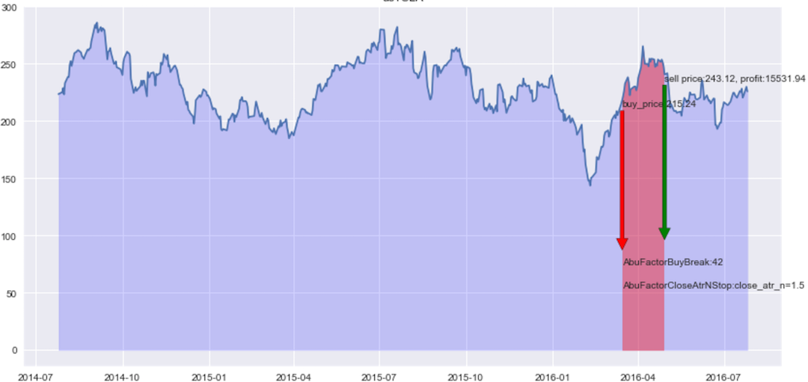
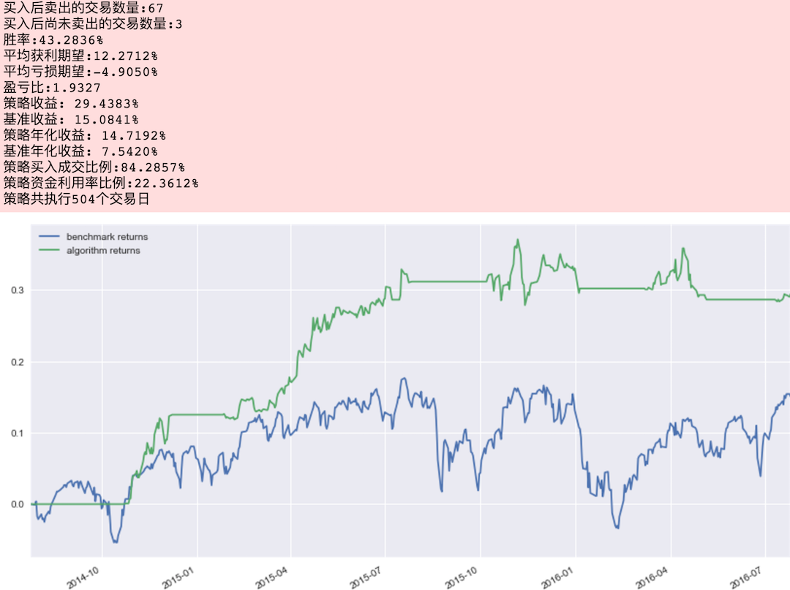
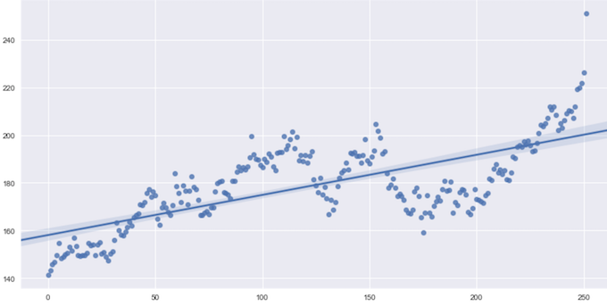
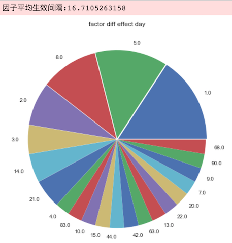
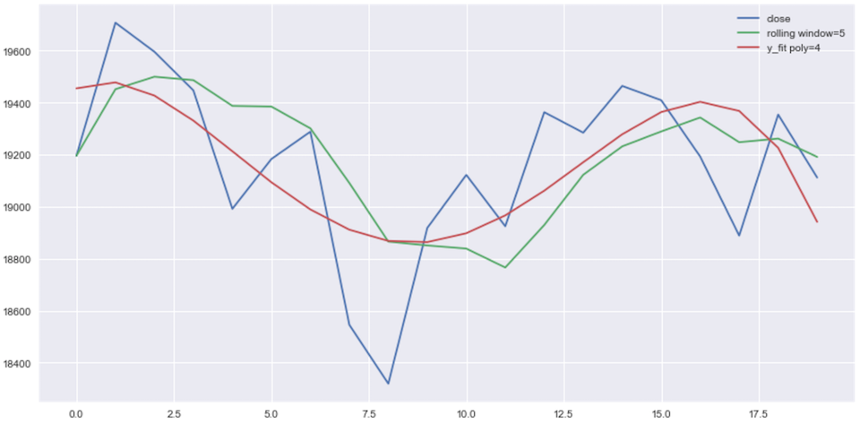
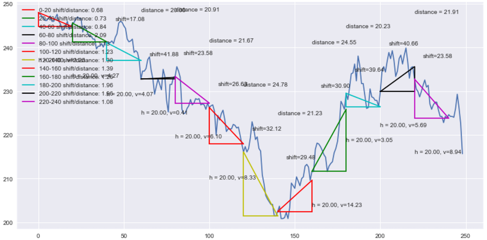
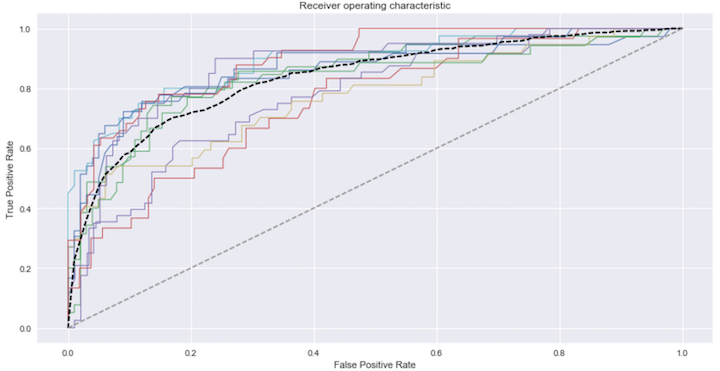
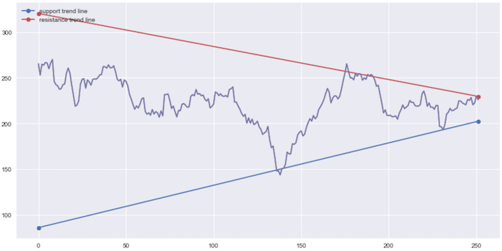
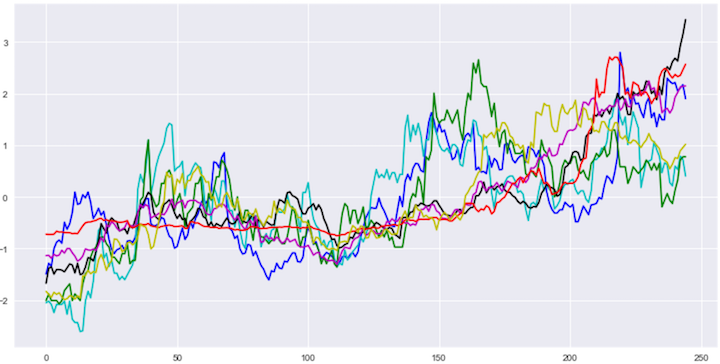
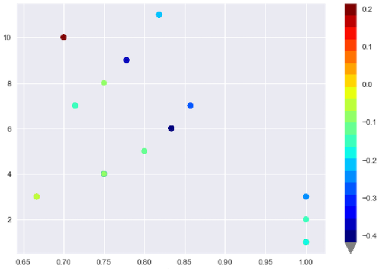

-----------------


abu能够帮助用户自动完善策略，主动分析策略产生的交易行为，智能拦截策略生成的容易失败的交易单。

现阶段的量化策略还是人工编写的代码，abu量化交易系统的设计将会向着由计算机自动实现整套流程的方向迈进，包括编写量化策略本身。

我们对未来的期望是：abupy用户只需要提供一些简单的种子策略，计算机在这些种子基础上不断自我学习、自我成长，创造出新的策略，并且随着时间序列数据不断智能调整策略的参数。

### 索引

| 内容 | 位置 | 
| ------| ------ | 
| 阿布量化系统源代码 | abupy目录 |
| 阿布量化使用教程 | abupy_lecture目录 |
| 阿布量化非编程界面操作 | abupy_ui目录 |
| 《量化交易之路》示例代码 | ipython／python目录| 
| 《机器学习之路》示例代码 | https://github.com/maxmon/abu_ml | 

### 特点

* 使用多种机器学习技术智能优化策略
* 在实盘中指导策略进行交易，提高策略的实盘效果，战胜市场

### 支持的投资市场:

* 美股，A股，港股
* 期货，期权
* 比特币，莱特币

### 工程设计目标：

* 分离基础策略和策略优化监督模块
* 提高灵活度和适配性

## 安装

### 部署

推荐使用Anaconda部署Python环境，详见 [量化环境部署](http://www.abuquant.com/lecture/lecture_0.html)

### 测试

```python
import abupy
```
## 界面操作（非编程）


[更多界面操作示例](./abupy_ui/readme.md)

## 使用文档

### 1：择时策略的开发

[第一节界面操作教程视频播放地址](https://v.qq.com/x/page/g0555b9k6ge.html)

择时策略决定什么时候买入投资品，回测告诉我们这种策略在历史数据中的模拟收益如何。

1. 买入择时因子的编写
2. 分解模式一步一步对策略进行回测
3. 卖出择时因子的实现

>在对的时间，遇见对的人(股票)，是一种幸福 
>
>在对的时间，遇见错的人(股票)，是一种悲伤 
>
>在错的时间，遇见对的人(股票)，是一声叹息 
>
>在错的时间，遇见错的人(股票)，是一种无奈 

[详细阅读](http://www.abuquant.com/lecture/lecture_1.html)

### 2: 择时策略的优化

通过止盈止损保护策略产生的利润，控制风险。

1. 基本止盈止损策略
2. 风险控制止损策略
3. 利润保护止盈策略



[详细阅读](http://www.abuquant.com/lecture/lecture_2.html)

### 3: 滑点策略与交易手续费

考虑应用交易策略时产生的成交价格偏差及手续费。

1. 滑点买入卖出价格确定及策略实现
2. 交易手续费的计算以及自定义手续费

| type | date | symbol | commission |
| ------| ------ | ------ | ------ |
| buy | 20150423 | usTSLA | 8.22 |
| buy | 20150428 | usTSLA | 7.53 |
| sell | 20150622 | usTSLA | 8.22 |
| buy | 20150624 | usTSLA | 7.53 |
| sell | 20150706 | usTSLA | 7.53 |
| sell | 20150708 | usTSLA | 7.53 |
| buy | 20151230 | usTSLA | 7.22 |
| sell | 20160105 | usTSLA | 7.22 |
| buy | 20160315 | usTSLA | 5.57 |
| sell | 20160429 | usTSLA | 5.57 |

[详细阅读](http://www.abuquant.com/lecture/lecture_3.html)

### 4: 多支股票择时回测与仓位管理

针对多支股票实现择时策略，通过仓位管理策略控制风险。

1. 多支股票使用相同的因子进行择时
2. 自定义仓位管理策略的实现
3. 多支股票使用不同的因子进行择时 
4. 使用并行来提升择时运行效率



[详细阅读](http://www.abuquant.com/lecture/lecture_4.html)

### 5: 选股策略的开发

一个好的策略需要一个好的标的。

1. 选股因子的编写
2. 多个选股因子并行执行
3. 使用并行来提升选股运行效率



[详细阅读](http://www.abuquant.com/lecture/lecture_5.html)

### 6: 回测结果的度量

正确的度量引领着正确的前进方向。

1. 度量的基本使用方法
2. 度量的可视化
3. 扩展自定义度量类



[详细阅读](http://www.abuquant.com/lecture/lecture_6.html)

### 7: 寻找策略最优参数和评分

通过定制的评分机制，寻找一个策略最合理的参数，比如：应该考虑多少天的均线？

1. 参数取值范围
2. Grid Search寻找最优参数
3. 度量结果的评分
4. 不同权重的评分
5. 自定义评分类的实现

[详细阅读](http://www.abuquant.com/lecture/lecture_7.html)

### 8: A股市场的回测

1. A股市场的回测示例
2. 涨跌停的特殊处理
3. 对多组交易结果进行分析


[详细阅读](http://www.abuquant.com/lecture/lecture_8.html)

### 9: 港股市场的回测

1. 港股市场的回测示例
2. 优化策略，提高系统的稳定性
3. 将优化策略的'策略'做为类装饰器进行封装



[详细阅读](http://www.abuquant.com/lecture/lecture_9.html)

### 10: 比特币, 莱特币的回测

1. 比特币, 莱特币的走势数据分析
2. 比特币, 莱特币的走势可视化分析
3. 比特币，莱特币市场的回测

* 比特币loss10: [-26.895, -3.284] , top10：(4.182, 38.786]
* 比特币最近一年风险下降：loss10: [-16.273, -2.783], top10：(3.948, 15.22]
* 莱特币loss10: [-28.48, -4.1]， top10：(4.405, 41.083]
* 莱特币最近一年继续呈现高风险loss10：[-22.823, -3.229] 高收益top10：(5.0606, 37.505]


| btcchange | btc365change | ltcchange | ltc365change |
| ------| ------ | ------ | ------ |
| [-26.895, -3.284] | [-16.273, -2.783] | [-28.48, -4.1] | [-22.823, -3.229] |
| (-3.284, -1.547] | (-2.783, -1.056] | (-4.1, -2.022] | (-3.229, -1.375] |
| (-1.547, -0.8] | (-1.056, -0.424] | (-2.022, -0.922] | (-1.375, -0.655] |
| (-0.8, -0.224] | (-0.424, -0.071] | (-0.922, -0.389] | (-0.655, -0.226] |
| (-0.224, 0.143] | (-0.071, 0.272] | (-0.389, 0] | (-0.226, 0.078] |
| (0.143, 0.568] | (0.272, 0.698] | (0, 0.413] | (0.078, 0.453] |
| (0.568, 1.108] | (0.698, 1.316] | (0.413, 0.977] | (0.453, 0.913] |
| (1.108, 2.171] | (1.316, 2.334] | (0.977, 1.889] | (0.913, 1.957] |
| (2.171, 4.182] | (2.334, 3.948] | (1.889, 4.405] | (1.957, 5.0606] |
| (4.182, 38.786] | (3.948, 15.22] | (4.405, 41.083] | (5.0606, 37.505] |

[详细阅读](http://www.abuquant.com/lecture/lecture_10.html)

### 11: 期货市场的回测

1. 期货市场的特点
2. 看涨合约的回测
3. 看跌合约的回测
4. 位移路程比优化策略



[详细阅读](http://www.abuquant.com/lecture/lecture_11.html)

### 12: 机器学习与比特币示例

如何在投资品的量化交易中正确使用机器学习技术？

1. 比特币特征的提取
2. abu中内置机器学习模块的使用
3. 测试集的验证与非均衡技术
4. 继承AbuMLPd对数据处理进行封装



[详细阅读](http://www.abuquant.com/lecture/lecture_12.html)

### 13: 量化技术分析应用

技术分析三大假设：市场行为涵盖一切；价格沿趋势移动；历史会重演。

1. 阻力线，支撑线自动绘制
2. 跳空技术分析
3. 传统技术指标技术分析



[详细阅读](http://www.abuquant.com/lecture/lecture_13.html)

### 14: 量化相关性分析应用

相似的投资品数据的背后，往往是相似行为模式的投资人群。

1. 相关相似度的度量
2. 距离的度量与相似度
3. 相似相关接口的应用
4. 自然相关性



[详细阅读](http://www.abuquant.com/lecture/lecture_14.html)

### 15: 量化交易和搜索引擎

搜索策略生成的失败交易，由裁判拦截住冲动的交易者。

1. 切分训练集交易的回测
2. 对交易进行人工分析
3. 主裁系统原理
4. 角度主裁
5. 赋予宏观上合理的解释
6. 最优分类簇筛选


[详细阅读](http://www.abuquant.com/lecture/lecture_15.html)

### 16: UMP主裁交易决策


1. 跳空主裁
2. 价格主裁
3. 波动主裁
4. 验证主裁是否称职, 在abu系统中开启主裁拦截模式
5. 组织裁判进行更复杂的综合裁决
6. 让裁判自己学习怎么配合，自己做出最正确的判断



[详细阅读](http://www.abuquant.com/lecture/lecture_16.html)

### 17: UMP边裁交易决策

1. 角度边裁
2. 价格边裁
3. 波动边裁
4. 综合边裁
5. 验证边裁是否称职
6. 在abu系统中开启边裁拦截模式

[详细阅读](http://www.abuquant.com/lecture/lecture_17.html)

### 18: 自定义裁判决策交易

1. 从不同视角训练新的主裁
2. 从不同视角训练新的边裁
3. 添加新的视角来录制比赛（记录回测特征）
4. 主裁使用新的视角来决策交易
5. 边裁使用新的视角来决策交易

abupy中ump模块的设计目标是：

* 不需要在具体策略中硬编码
* 不需要人工设定阀值，即且使得代码逻辑清晰
* 分离基础策略和策略优化监督模块，提高灵活度和适配性
* 发现策略中隐藏的交易策略问题
* 可以通过不断的学习新的交易数据

[详细阅读](http://www.abuquant.com/lecture/lecture_18.html)

### 19: 数据源

abu支持股票、期货、数字货币等多种金融投资品的行情和交易，并具有高度可定制性。

1. 数据模式的切换
2. 数据存储的切换
3. 数据源的切换
4. 全市场数据的更新
5. 接入外部数据源，股票数据源
6. 接入外部数据源，期货数据源
7. 接入外部数据源，比特币，莱特币数据源

[详细阅读](http://www.abuquant.com/lecture/lecture_19.html)

## 联系我们

更多abu量化教程请关注我们的微信公众号: abu_quant

如有任何问题也可在公众号中联系我的个人微信号


### License
[GPL](./LICENSE)